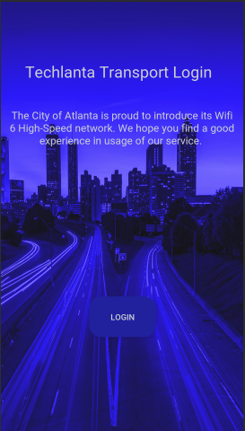

# TechlantaTransport
This repository is my prototype for Techlanta Transport: A proposal that utilizes 
a IoT (Internet of Things) and Cisco technologies to improve/overhaul Atlanta's traffic infrastructure.

This prototype was developed during my time as a Cisco High Extern (2019) and done alongside
the Techlanta Transport team: Hari Annamraju, Noel Bosco, Kamryn Jones, Keya Parikh.

